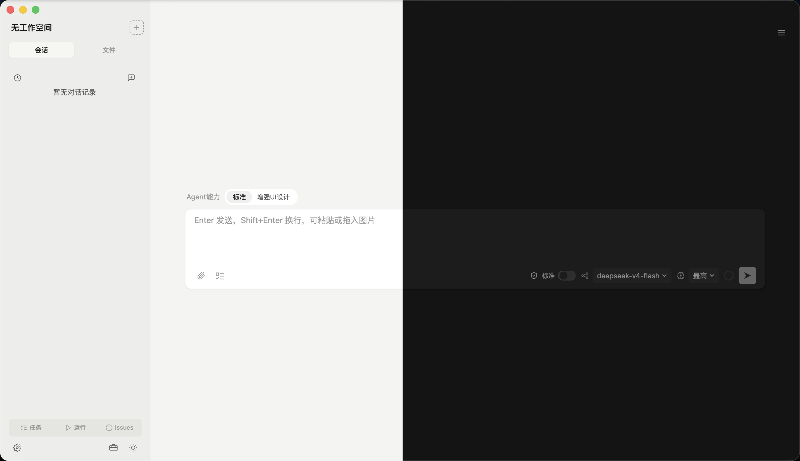
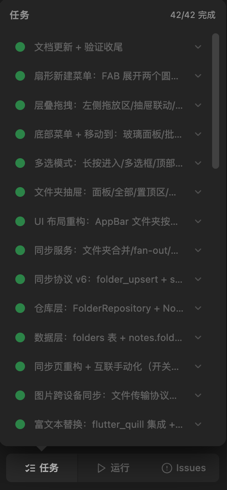
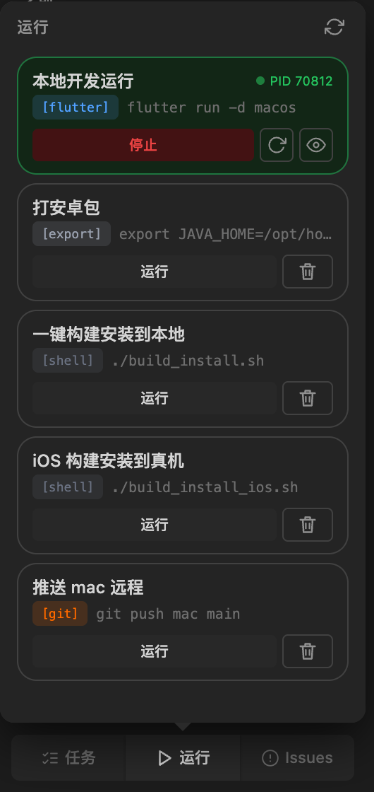
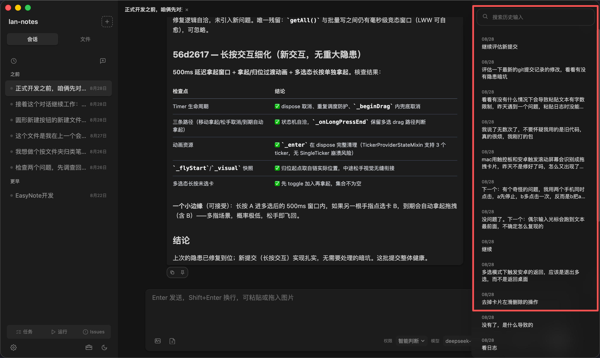
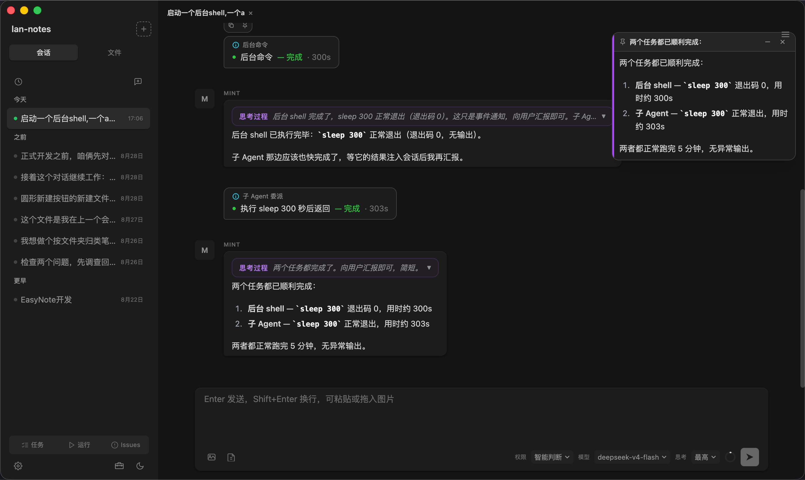
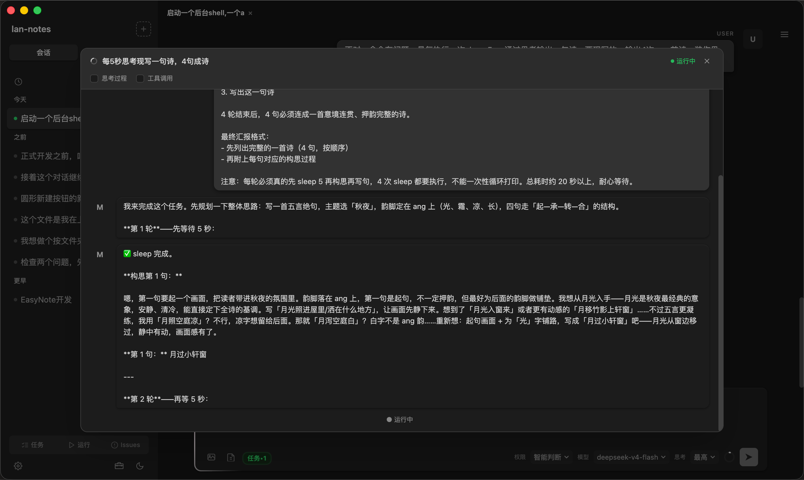
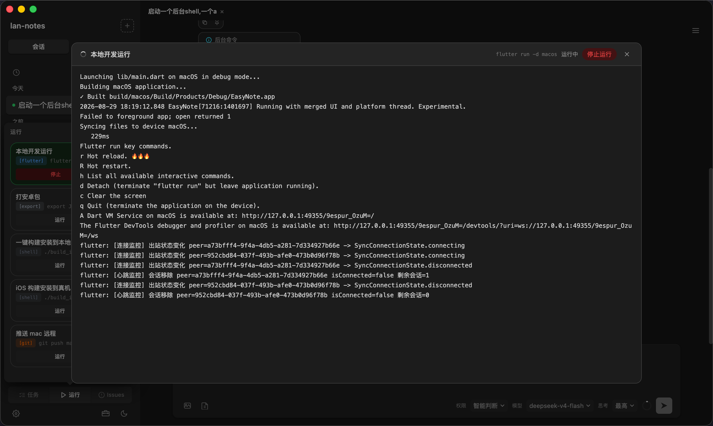
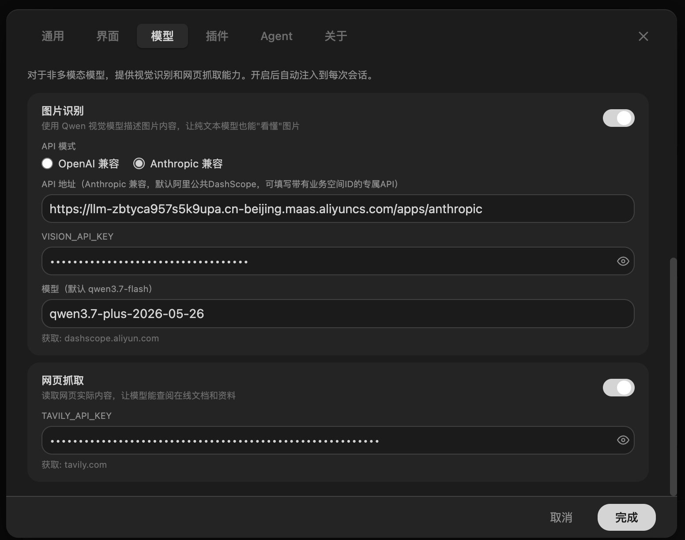
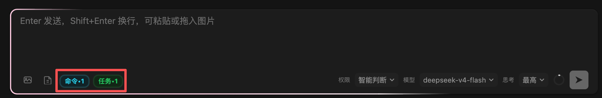

[简体中文](README.md) | [English](README.en.md)

<p align="center">
  <picture>
    <source media="(prefers-color-scheme: dark)" srcset="assets/appicon-dark.png" />
    
  </picture>
</p>

<h1 align="center">EasyMint</h1>

<p align="center">
  <strong>An open-source desktop AI coding platform with a built-in Pi Agent.</strong>
</p>

<p align="center">
  <a href="https://github.com/tianemon/EasyMint/releases"></a>
  
  
</p>

---

## Overview

EasyMint is an **open-source desktop AI coding platform with a built-in Pi Agent**. [Pi Coding Agent](https://github.com/earendil-works/pi) provides the coding engine, while EasyMint adds a graphical interface, multi-agent collaboration, and project guidance from requirements to delivery.

It supports two kinds of users:

- **Beginners**: guided conversations collect requirements and confirm prototypes and technical plans. Drive development through conversation and choices.
- **Developers**: use multi-agent collaboration, session management, and cross-device migration as a daily AI coding workspace.

Projects can start in two ways, with the option to switch at any time:

- **Start with a conversation**: describe your idea directly. Mint fills in missing details through a guided workflow. You can also skip the guidance and let the AI work from your description.
- **Start with a form**: provide a name, use case, features, style, and budget. Mint follows up on open questions in the conversation.

## Why EasyMint

Writing code is only part of delivering usable software. Requirements, prototypes, technical decisions, and acceptance checks also need attention. **EasyMint brings these steps into one desktop application**: clarify requirements, produce an interactive prototype, confirm the technical plan, and check the result against the approved prototype.

- **Guidance without assuming coding experience**: seven gates cover intent, scope, prototype, user approval, technical plan, development, and acceptance against the approved prototype. Each gate has a confirmation point.
- **Reusable project knowledge**: lessons learned are stored in Markdown, selected by technology stack, and reused across sessions alongside project rules.
- **Local data**: project files and session records stay in `~/.easymint/` and the project's `.easymint/` directory. Cross-device migration uses encrypted local-network transfer with whole-package verification. **No accounts and no telemetry.** When you start a conversation, prompts, project context, code, command output, and images are sent directly to your configured AI provider. See [PRIVACY.md](PRIVACY.md) for details (Chinese).
- **Isolated development environments**: Standard mode redirects dependencies, caches, and temporary files into a project-specific runtime. Commands run inside an operating-system sandbox: Seatbelt on macOS, bubblewrap on Linux, and a dedicated sandbox account on Windows. Network access uses a domain allowlist; eligible individual browser and container commands can use compatibility exemptions. `git push` can use the SSH agent in Standard mode. Tools such as `gh` that need host credentials may require Full access. Read-only mode is available for inspection. Full access uses your real environment without an OS sandbox; dangerous system operations receive best-effort checks before execution.
- **Choice of models and tools**: switch between provider presets and custom OpenAI- or Anthropic-compatible endpoints, with account login or API keys where supported. Reuse skills from the Claude Code, Codex, and GitHub Agent Skills ecosystems, as well as MCP plugins.

This provides:

1. **A path from an idea to running software**: Mint guides requirements, prototypes, technical planning, and acceptance. You can see an interactive prototype before implementation begins.
2. **Replaceable providers and tools**: changing prices, rate limits, or providers does not require replacing your workflow. Existing skills and compatible MCP configurations can be reused. See [CHANGELOG.md](CHANGELOG.md) for upgrade notes (Chinese).
3. **Portable data**: local storage, cross-device migration, and the MIT license let you move between devices and versions and inspect the source.

> EasyMint may be a poor fit if you only need inline code completion, prefer a CLI without project guidance, or need multiple people to collaborate on the same cloud-hosted sessions and documents. It does not provide cloud collaboration.

## Features

- **Conversational project guidance**: create projects through chat or forms. Seven gates cover intent, scope, prototype, user approval, technical planning (capability, current research, and cost checks), development, and acceptance against the approved prototype.
- **Prototypes first**: projects of moderate complexity or greater receive interactive HTML prototypes from the built-in designer agent and brand library before development.
- **Multi-agent collaboration**: project management, coding, evaluation, and design agents coordinate work until it is complete.
- **Subagent delegation**: delegate research, code exploration, and analysis; receive summaries without filling the main conversation with details. Progress and output are visible.
- **Permission modes**: Read-only, Standard (default), and Full access. Standard mode isolates the development environment and applies an OS sandbox and network allowlist. Full access uses the host environment after a risk confirmation.
- **Skill interoperability**: discover and reuse skills from Claude Code, Codex, and GitHub Agent Skills.
- **Pi extension interoperability**: discover native Pi extensions at user and project scope. Approved extensions are available to new Full access sessions; original settings and files stay in place.
- **Experience retention**: when enabled, Mint records useful lessons after tasks. Entries can be edited or deleted and reused by technology stack.
- **Context management**: monitor context usage, confirm compaction at a threshold, and interrupt compaction when needed.
- **Issue tracking**: record and edit issues, update their status, and let Mint work through the list.
- **Session management**: multiple tabs and windows, per-session activity state, archiving, and restoration.
- **Run panel**: detect, run, stop, restart, edit, and delete project scripts. Monitor ports and view ANSI-colored logs.
- **Input history**: search previous prompts in a side drawer and jump to the original message.
- **Pinned notes**: pin important AI output as resizable floating notes that persist with the session.
- **Local ownership**: project and session data stay on your machine. [PRIVACY.md](PRIVACY.md) explains provider requests, agent capabilities, and credential storage (Chinese).
- **Cross-device migration**: discover devices on the same LAN, pair once, and transfer projects and historical sessions with file selection and ignore rules. The receiving device confirms each transfer. Encryption and package verification protect transfers; interrupted transfers do not leave partially imported projects.

## Screenshots

Screenshots show the Chinese interface.

| Main window |
|---|
|  |

| Task panel | Run panel |
|---|---|
|  |  |

| Input history | Pinned notes |
|---|---|
|  |  |

| Subagent output | Shell output |
|---|---|
|  |  |

| Vision model settings | Input status indicators |
|---|---|
|  |  |

## Multi-agent collaboration

- **Mint (project manager)**: understands requirements, breaks work into `task.json`, coordinates agents, and tracks progress.
- **Builder (coding)**: implements tasks, runs tests, and fixes problems; supports TDD.
- **Evaluator (acceptance)**: checks the result against requirements and returns incomplete work for revision.
- **Mint-D (UI design)**: produces HTML prototypes using the brand library and design guidelines.
- **General subagents**: handle typed exploration, review, and implementation tasks, returning summaries to the main session.

Task progress is visible in the panel. Role-specific tasks use their assigned templates; general tasks use standard subagents. Delegation depth and task types are controlled.

## Permissions and security

EasyMint checks commands **before execution**. Standard and Read-only modes also apply operating-system enforcement. Three categories define the boundaries:

- **System core**: system directories, raw devices, and disk or security mechanisms such as `csrutil`, `spctl`, and `fdesetup` are blocked in all modes.
- **Dangerous operations**: privilege escalation (`sudo` / `doas`), system service changes, and persistent configurations that can execute code—such as MCP configuration, startup directories, and EasyMint model/provider settings—are blocked in all modes.
- **Ordinary resources**: Read-only and Standard modes restrict resource access to the project workspace, its runtime, and system temporary directories, with sensitive credential access blocked. Full access removes the ordinary workspace restriction.

Pi extensions are explicitly approved main-process code and load only in **Full access** sessions. Extension initialization and event handlers do not pass through the ordinary tool sandbox. When switching to Standard or Read-only, the current response may finish, extension tools stop immediately, and the session is rebuilt with the new permissions when idle.

The modes differ as follows:

- **Read-only**: allows approved read tools for ordinary project content. Unknown tools, commands, file and application-state changes, MCP, network access, and sensitive credentials are blocked. Builds, tests, dependency installation, and Git operations are unavailable.
- **Standard (default)**: redirects `HOME`, `TMPDIR`, and npm/pip/cargo caches into `~/.easymint/runtimes/<project>/`. Commands run inside the OS sandbox. A compatibility list, single-command exemptions, and network allowlist support development tools. The `open` exemption accepts one HTTP(S) URL; compound commands, pipes, redirections, and command substitution do not qualify. `git push` and `fetch` can use SSH-agent signing when the key is already loaded. Tools needing host login directories may require Full access.
- **Full access**: uses the real host environment without an OS sandbox. Tools such as `gh`, Git, system commands, browsers, and Playwright can use the host environment. Switching requires a risk confirmation. Protection for system-core writes, privilege escalation, and persistent configuration is best effort before execution, not strong isolation against dynamic scripts.
- **Conservative preflight checks**: checks target identifiable paths and privilege escalation. Message text, regular expressions, and script content are not treated as file paths. Kernel enforcement provides the additional boundary in sandboxed modes.
- **Visible mode indicators**: the input card shows a lock shield for Read-only, a checked shield for Standard, and a warning shield with a danger color for Full access.

**Data sharing is a separate boundary.** Conversation content, files read by the agent, command output, injected project context, and images are sent directly to the AI provider you configure. Its privacy and retention policies apply. Web search and extraction use Tavily. See [PRIVACY.md](PRIVACY.md) for the full list, telemetry policy, and storage details (Chinese).

## Experience retention

When enabled in settings (off by default), Mint can retain useful lessons from completed tasks:

- **Two scopes**: global knowledge for the local environment and working practices; project knowledge that travels with the project.
- **Index-only context**: titles, tags, and counts are injected; full entries are read on demand.
- **Technology-aware selection**: entries tagged for a stack or platform appear only in matching projects.
- **Editable Markdown**: entries are saved directly without a separate confirmation and can be edited or deleted at any time.

## Project management

- File tree and Monaco editor with syntax highlighting and completion.
- Multiple session tabs and windows.
- Project renaming with automatic session-data migration, relocation, and existing-directory import.
- Git integration.
- Cross-device transfer of files and sessions.

## Pinned notes

Pin important AI output as floating notes in the chat area. Notes can be resized, attached as colored sticky notes, and persisted with the session.

## Agent templates

Mint, Builder, Evaluator, and Mint-D each have built-in templates. All except Mint can be edited. Custom templates can specify responsibilities, provider, model, and thinking level.

## Skills

- **Automatic discovery**: discover standard skills in Claude Code (`~/.claude/skills/`), Codex (`~/.codex/skills/`), and project GitHub Agent Skills (`.github/skills/`) directories without changing the original files.
- **Project precedence**: skills in a project's `.claude/skills/`, `.codex/skills/`, and `.github/skills/` override global skills with the same name. The interface shows their source and shadowed status.
- **Install from a path or link**: send Mint a GitHub repository URL or local skill directory. Installation copies files without running repository scripts.
- **AI-managed skills**: enable skill management in settings to let Mint create, update, and delete skills in a dedicated area separate from manually authored skills.

## Workflow

1. **Create a project** through conversation or a form.
2. **Refine the plan** through requirements, feature discussions, prototype approval, and technical planning.
3. **Develop with agents** that break work into tasks and iterate between implementation and evaluation.
4. **Keep iterating** by describing requirement changes; new tasks are appended incrementally.

## Installation

Download an installer from [Releases](https://github.com/tianemon/EasyMint/releases):

- **macOS**: `.dmg` for Apple Silicon.
- **Windows**: `.exe` installer or portable edition for x64.
- **Linux**: `.AppImage`, `.deb`, or `.tar.gz` for x64.

Choose an AI provider on first launch. Use account authorization where supported, or enter an API key. See “AI providers” below.

## Mobile client (Android / iOS)

Connect a phone to the desktop application on the **same local network**. After QR-code pairing, use the phone to send messages, view model thinking and tool calls, answer questions, monitor background tasks and subagents, and attach images or documents to conversations in the currently open desktop project.

Mobile repository: [**tianemon/EasyMintMobile**](https://github.com/tianemon/EasyMintMobile).

- **Install**: download the Android APK from [EasyMintMobile Releases](https://github.com/tianemon/EasyMintMobile/releases). iOS requires your own signing; the repository includes local build scripts.
- **Pair**: open the desktop sidebar toolbox (工具箱), choose “Connect phone” (连接手机), scan the QR code, compare the six-digit code, and confirm on the desktop.

The phone stores pairing credentials only. Projects, sessions, and messages stay on the computer. Communication uses P-256 ECDH and AES-256-GCM encryption. The desktop does not send project absolute paths or API keys to the phone.

## AI providers

Presets include **Anthropic, OpenAI, OpenAI Codex, GitHub Copilot, OpenRouter, DeepSeek, Zhipu GLM (Z.AI), Kimi, MiniMax, Qwen, Xiaomi MiMo, xAI, Google Gemini, and OpenCode**. Custom OpenAI- and Anthropic-compatible providers are also supported. Configure multiple providers and switch between them. A separate vision model can handle image understanding and interface checks.

Authentication depends on the provider:

- **Account login (browser authorization)**: available presets include Anthropic (token-based charges rather than plan allowance), OpenAI Codex (ChatGPT Plus / Pro account), GitHub Copilot (subscription account), OpenRouter, Kimi Coding, and xAI.
- **API key**: used by the other built-in presets—including OpenAI, DeepSeek, Zhipu GLM / Z.AI, MiniMax, Qwen, Google Gemini, Xiaomi MiMo, and OpenCode—and custom providers. Keys and account credentials are stored locally **in plaintext under `~/.easymint/`**, comparable to `.npmrc`, `git-credentials`, or `~/.aws/credentials`. MCP OAuth credentials use system-keychain encryption. See [PRIVACY.md](PRIVACY.md) (Chinese).

> Supported authentication methods come from the built-in engine's provider declarations. The settings selector appears only when both methods are supported. **OpenAI and OpenAI Codex are separate presets**: OpenAI uses the official API (`api.openai.com`) with an API key; OpenAI Codex uses the subscription endpoint (`chatgpt.com/backend-api`) with account login.

## Web search

Mint uses [Tavily](https://tavily.com) for web search and page extraction. Create your own API key at [app.tavily.com/home](https://app.tavily.com/home) and enter it in the web capability settings (联网能力). Search and extraction share the same key; the provider step in onboarding configures that same setting.

Tavily's free allowance is **1,000 credits per month**, with this application's basic search calls costing **1 credit each** and extraction costing **1 credit per five successful page extractions**. That corresponds to roughly 1,000 searches or 5,000 extractions, or about 600 rounds of one search plus three page reads. Failed extractions do not consume credits.

Without the key, Mint cannot search or extract web pages and relies on the model's existing knowledge. Clearing the key disables both capabilities; there is no separate toggle.

## Vision

For text-only models, configure a separate vision model through an OpenAI- or Anthropic-compatible endpoint to read images and check screenshots. Providing a key enables the capability; clearing it disables the capability. There is no separate toggle.

## Technology stack

| Layer | Technology |
|---|---|
| Desktop | Electron 43 |
| Frontend | React 19 + Vite + TypeScript 6 |
| UI | Tailwind CSS 4 + custom components |
| State | Zustand 5 |
| Editor / terminal | Monaco Editor / xterm.js |
| Plugins | Pi Extensions / Model Context Protocol SDK |
| AI engine | Pi Coding Agent 1.0.4 |

## Local development

```bash
git clone https://github.com/tianemon/EasyMint.git
cd EasyMint
npm install
npm run dev          # Vite dev server + Electron
npm run build        # Production build
npm run lint         # ESLint + TypeScript checks
```

Requires a Node.js environment.

---

EasyMint uses the open-source Pi Coding Agent engine for agent orchestration, multi-role collaboration, and context management. Its guided workflow covers the main steps from an idea to a working product.

## Development story

EasyMint's development is itself an experiment in AI coding: approximately 99% of the project was produced using DeepSeek models (the lowest-cost flash tier since July), growing from a 14-file shell template into a desktop product.

[**Building a desktop coding agent with a low-cost model**](PROJECT_STORY.md) (Chinese).

## Interface language

Choose Simplified Chinese, English, or Follow system on the welcome page or under **Settings → General → Interface language** (设置 → 通用 → 界面语言). Existing installations keep Simplified Chinese by default.

English coverage is being added in stages. Main navigation, General settings, About, and related entry points are supported; model, plugin, chat, and environment-check modules still contain Chinese text. Switching the interface language does not rewrite chat history, user content, or built-in prompts. AI responses continue to follow the user's language.
