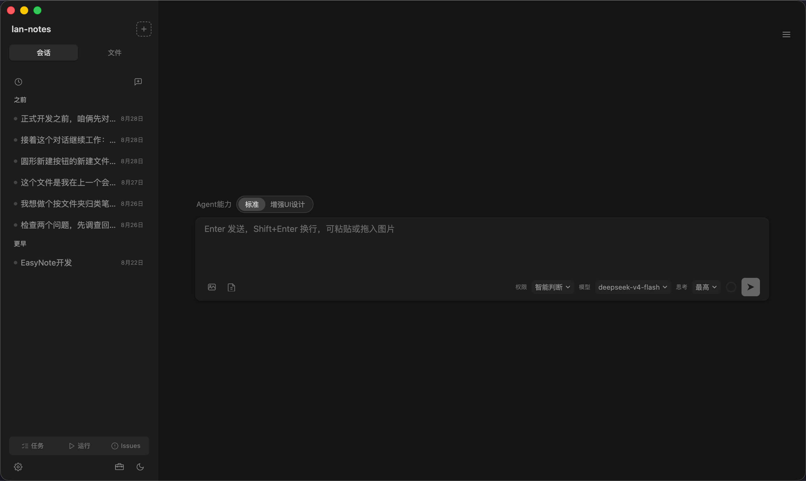
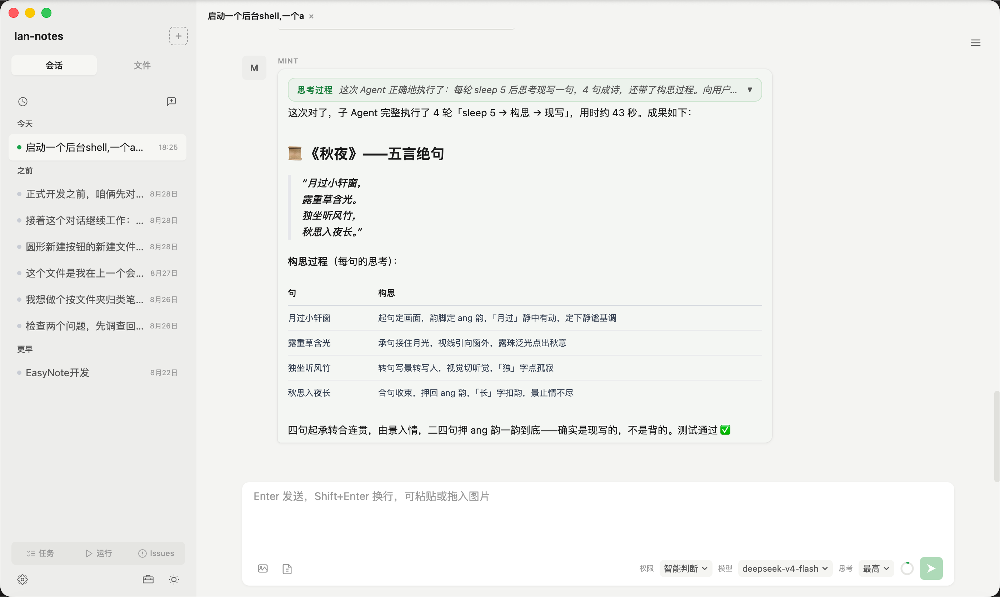
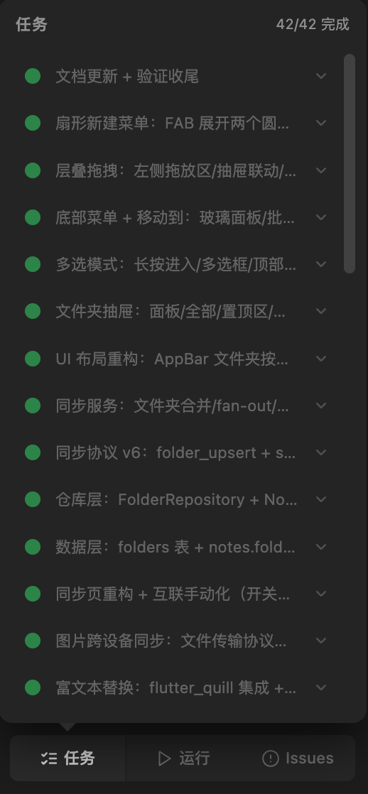
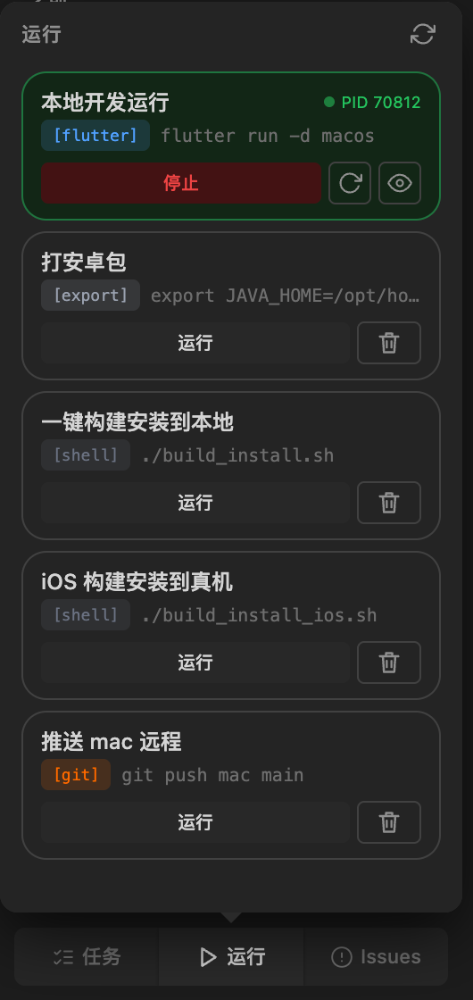
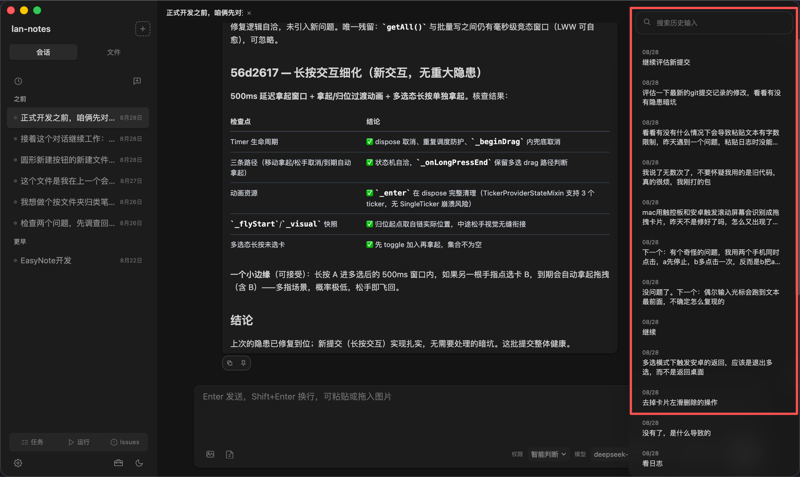
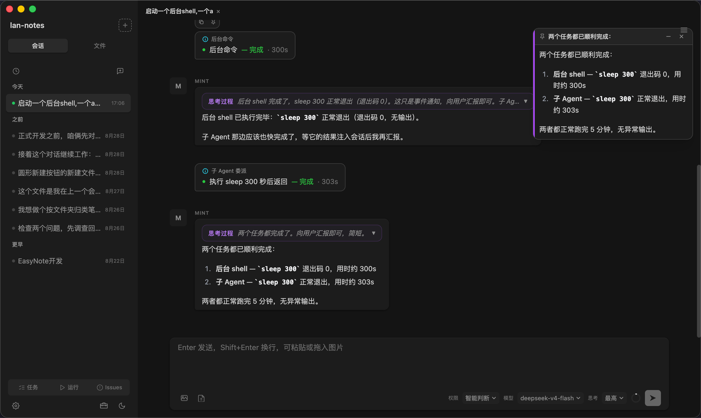
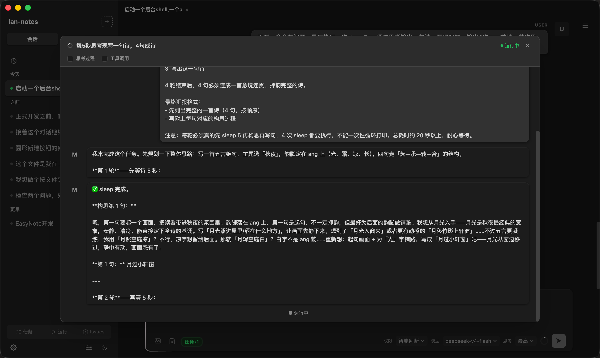
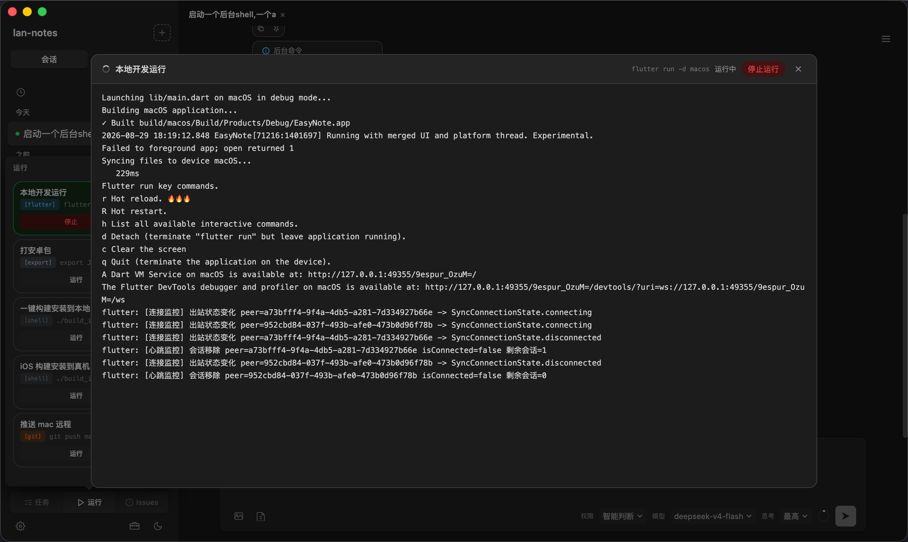
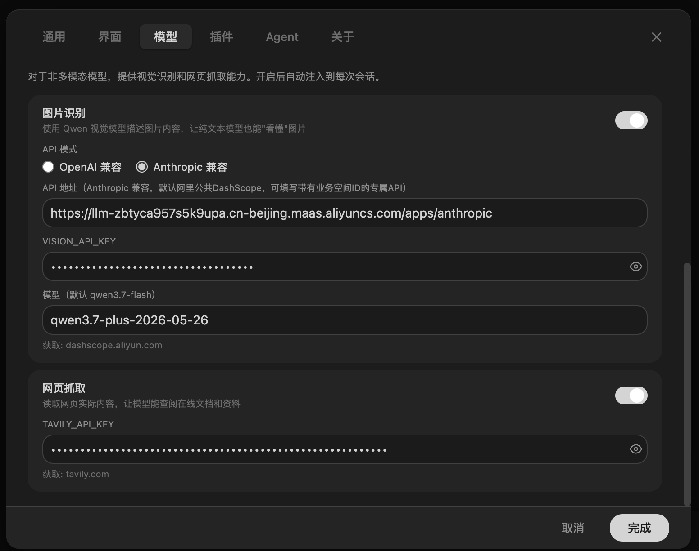
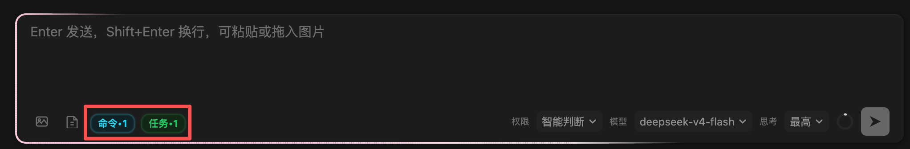

<p align="center">
  
</p>

<h1 align="center">EasyMint</h1>

<p align="center">
  <strong>围绕 Pi Coding Agent 构建的开源 AI 编程 Harness。</strong>
</p>

<p align="center">
  <a href="https://github.com/tianemon/EasyMint/releases"></a>
  
  
</p>

---

## 定位

EasyMint 是一个**开源 AI 编程 Harness**——围绕 [Pi Coding Agent](https://github.com/pi-ai-engineering/pi-coding-agent) 构建的桌面应用。Pi Coding Agent 是开源的 AI 编程引擎，其专业能力足以支撑完整的软件开发流程；EasyMint 在其之上提供图形化界面、多 Agent 协作与项目引导，覆盖从需求采集到成品交付的完整链路。

面向两类使用场景：

- **编程新手**：通过对话引导完成需求采集、原型确认与技术方案确认，以点选和对话的方式驱动开发
- **开发者**：使用多 Agent 协作、会话管理与跨设备迁移等能力，作为日常的 AI 编程工作台

创建项目支持两条路径，均可随时切换：

- **对话直接创建**：不经过表单，直接描述想法。Mint 按引导流程主动补全信息，也支持跳过引导自由描述、由 AI 自行理解推进
- **表单创建**：通过结构化表单采集基本信息（名称/场景/功能/风格/预算），Mint 在对话中补全开放信息

## 核心特性

- **对话式项目引导**——双路径创建（对话直接创建 / 表单创建），按场景与认知水平自动调整引导深度；7 道 Gate 把关（需求意图 → 范围 → 原型 → 确认 → 技术方案 → 开发 → 对照验证）
- **原型先行**——中等及以上项目先产出可交互 HTML 原型（内置设计师 Agent 与品牌库），确认后才进入开发
- **多 Agent 协作**——项目经理 Agent 拆解需求、编码 Agent 实现、验收 Agent 检查、设计师 Agent 出原型，自动循环直至完成
- **子 Agent 委派**——查资料、读代码、分析问题等任务委派标准子 Agent 执行并回传摘要，避免挤占主会话上下文；委派过程可视化（进度卡片/过程弹层）
- **上下文自管理**——上下文使用率实时显示，达到阈值弹窗确认整理，压缩过程透明可中断；长对话不「失忆」
- **Issue 闭环**——开发中的问题可记录、编辑、标记状态，Mint 读取清单并同步修复进度
- **会话管理**——多 Tab 会话、多窗口；会话状态（思考/工具/压缩）按会话隔离互不串扰；会话可归档与恢复
- **运行面板**——项目脚本一键检测/运行/停止/重启，端口占用实时监控，彩色日志输出窗口（ANSI 渲染），脚本可编辑与删除
- **历史输入检索**——当前会话提问记录一键回顾（右侧抽屉 + 关键词搜索），点击跳转对应消息
- **内容便签**——AI 输出的重要内容可一键钉成悬浮便签，调整大小、吸附固定、随会话持久化
- **数据主权**——项目文件与会话数据全部存储本地（`~/.easymint/` 与项目内 `.easymint/`），不上云、不锁定
- **跨设备迁移**——项目文件与历史会话可完整迁移到另一台设备，支持文件级选择、多会话迁移与忽略配置

## 界面预览

| 暗色主题 | 亮色主题 |
|---|---|
|  |  |

| 任务面板 | 运行面板 |
|---|---|
|  |  |

| 历史输入抽屉 | 内容便签 |
|---|---|
|  |  |

| 子 Agent 输出窗口 | Shell 输出窗口（ANSI 彩色） |
|---|---|
|  |  |

| 第三方视觉模型设置 | 输入卡片（Agent / Shell 状态胶囊） |
|---|---|
|  |  |

## 多 Agent 协作

- **Mint（项目经理）**——需求理解、任务拆解（task.json）、Agent 调度、进度把控
- **Builder（编码）**——按任务实现代码、运行测试、修复问题，支持 TDD
- **Evaluator（验收）**——对照需求检查产出，不合格退回重做
- **Mint-D（UI 设计）**——产出 HTML 原型，内置品牌库与设计规范
- **子 Agent（通用委派）**——探索、审查、实现等类型化委派，回传摘要不占主上下文

任务进度在面板实时展示；角色任务指定对应模板，通用任务使用标准子 Agent，委派深度与类型受控。

## 项目管理

- 文件树 + Monaco 编辑器（语法高亮、智能提示）
- 多 Tab 会话、多窗口
- 项目重命名（会话数据自动迁移）/ 重新定位 / 导入已有目录
- Git 集成
- 跨设备项目迁移（文件与会话）

## 内容便签

AI 输出的重要内容可钉成悬浮便签固定在聊天区：一键钉住、可调大小、吸附成彩色贴纸、随会话持久化。

## Agent 模板

Mint / Builder / Evaluator / Mint-D 各有内置模板，除 Mint 外可编辑；可新建自定义模板，指定职责、供应商、模型与思考级别。

## 使用流程

1. **新建项目**——直接对话描述想法（Mint 引导补全），或通过表单快速创建
2. **对话引导**——需求采集 → 功能共创 → 原型确认 → 技术方案
3. **自动开发**——任务拆解后由编码/验收 Agent 循环推进，进度实时可见
4. **持续迭代**——需求变更直接对话，任务增量追加

## 安装

前往 [Releases 页面](https://github.com/tianemon/EasyMint/releases) 下载安装包：

- **macOS**：`.dmg`
- **Windows**：`.exe`

首次启动选择 AI 供应商并配置 API Key。

## AI 供应商

内置 DeepSeek、Kimi、MiniMax、智谱等主流平台预设，填写 API Key 即可使用；支持自定义供应商（OpenAI/Anthropic 兼容协议）；支持同时配置多个供应商并随时切换；**视觉模型独立配置**（图片理解/界面验证等场景可选专用模型）。

## 视觉识别

纯文本模型不具备识图能力时，可配置独立的视觉模型（OpenAI 或 Anthropic 兼容接口），使 AI 具备读取图片、核对界面截图的能力。

## 技术栈

| 层 | 技术 |
|----|------|
| 桌面框架 | Electron 43 |
| 前端 | React 19 + Vite + TypeScript 6 |
| UI | Tailwind CSS 4 + Radix UI |
| 状态管理 | Zustand 5 |
| 代码编辑器 | Monaco Editor |
| AI 引擎 | Pi Coding Agent 0.84 |

## 本地开发

```bash
git clone https://github.com/tianemon/EasyMint.git
cd EasyMint
npm install
npm run dev          # Vite dev server + Electron
npm run build        # 生产构建
npm run lint         # ESLint + TypeScript 类型检查
```

需要 Node.js 环境。

---

EasyMint 以开源的 Pi Coding Agent 为引擎，提供完整的 Agent 编排、多角色协作与上下文管理能力；上层通过引导流程降低上手门槛，覆盖从想法到成品的主要路径。
