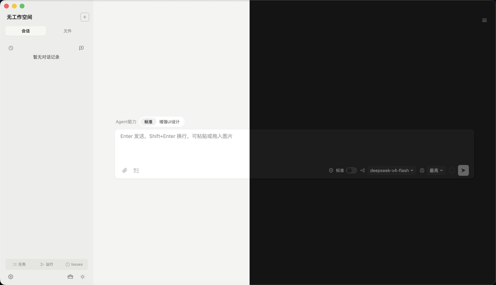

<p align="center">
  <picture>
    <source media="(prefers-color-scheme: dark)" srcset="assets/appicon-dark.png" />
    
  </picture>
</p>

<h1 align="center">EasyMint</h1>

<p align="center">
  <strong>内置 Pi Agent 的开源桌面 AI 编程平台。</strong>
</p>

<p align="center">
  <a href="https://github.com/tianemon/EasyMint/releases"></a>
  
  
</p>

---

## 定位

EasyMint 是一个**内置 Pi Agent 的开源桌面 AI 编程平台**——[Pi Coding Agent](https://github.com/earendil-works/pi) 作为内置的 AI 编程引擎，其专业能力足以支撑完整的软件开发流程；EasyMint 在其上提供图形化界面、多 Agent 协作与项目引导，覆盖从需求采集到成品交付的完整链路。

面向两类使用场景：

- **编程新手**：通过对话引导完成需求采集、原型确认与技术方案确认，以点选和对话的方式驱动开发
- **开发者**：使用多 Agent 协作、会话管理与跨设备迁移等能力，作为日常的 AI 编程工作台

创建项目支持两条路径，均可随时切换：

- **对话直接创建**：不经过表单，直接描述想法。Mint 按引导流程主动补全信息，也支持跳过引导自由描述、由 AI 自行理解推进
- **表单创建**：通过结构化表单采集基本信息（名称/场景/功能/风格/预算），Mint 在对话中补全开放信息

## 为什么选择 EasyMint

AI 已经能写代码，但"写出一个能用的软件"从来不只是写代码：需求靠猜、原型没有、方案没对齐、做完没人验收——这些环节通常得由懂技术的人自己盯。**EasyMint 把这条链路做实**：用对话把需求问清楚、先给可交互原型、确认后再定技术方案、开发完对照原型验收，全部在一个桌面应用里完成。

与常见的做法相比，它在这些地方不一样：

- **不假设你会写代码**——不是"你描述、AI 出代码"，而是**有流程**：7 道 Gate（需求意图 → 范围 → 原型 → 用户确认 → 技术方案 → 开发 → 对照已确认原型验收），每一步都有确认点，不确认不往下走
- **不让 AI 的方法论散落在聊天记录里**——常见做法是每开一个新会话就把项目背景重讲一遍；EasyMint 有**经验沉淀**（写进 markdown 文件、按技术栈投递、跨会话复用）与**项目级规则文件**，越用越顺手
- **不把数据放在云上**——项目文件与会话记录全部在本机（`~/.easymint/` 与项目内 `.easymint/`），换设备用局域网直传（加密 + 整包校验），不经过任何服务器
- **不弄脏你的机器，也不给你设路障**——标准模式把依赖、缓存、临时文件全部重定向到项目专属运行区（`HOME`/`TMPDIR`/npm、pip、cargo 缓存），删项目即干净、多项目互不串扰；同时命令跑在**系统级沙盒**里（macOS Seatbelt / Linux bubblewrap / Windows 独立沙盒账户），越界写入与凭据读取由内核拦下、脚本与变量绕不过去。出网按**域名白名单**放行，浏览器与容器类的单一命令可走兼容豁免；需要 `gh` 这类依赖本机登录态配置的工具时切完全访问（`git push` 走 ssh-agent 通道，标准模式直接可用）；只想让它读、不让它动手时切到**只读模式**。完全访问不套沙盒，系统危险操作只做执行前尽力拦截
- **不绑定在某一家模型或某一个工具生态上**——供应商可随时更换（10+ 平台预设 + 自定义 OpenAI / Anthropic 兼容接口，账号登录或密钥二选一）；skill 直接复用 Claude Code / Codex / GitHub Agent Skills 生态的既有资产，MCP 插件同样可用

这使得：

1. **不懂技术也能交付一个能跑的东西**——需求、原型、方案、验收四个确认点都由 Mint 主动推进，你只需要回答和点选；原型先行意味着**在写代码之前就能看见成品长什么样**。
2. **工具是可替换的**——模型涨价、限流、换供应商，都不需要换一套工作方式；已有的 skill 与 MCP 配置也继续有效，不锁定单一工具。
3. **数据是可以带走的**——全本地存储 + 跨设备迁移 + MIT 开源，随时能换设备、换版本，也可以直接看源码确认它到底做了什么。

> **什么时候不该用它**：只想在编辑器里补全几行代码——用 IDE 插件更轻；习惯自己掌控每一步、不需要引导流程——用纯命令行的编码 Agent 更合手；需要**多人云端协作**同一份会话与文档——本项目的数据是完全本地的，没有云端协作能力。

## 核心特性

- **对话式项目引导**——双路径创建（对话直接创建 / 表单创建），按场景与认知水平自动调整引导深度；**7 道 Gate** 把关（需求意图 → 范围 → 原型 → 用户确认 → 技术方案〔能力 / 实时检索 / 成本三重验证〕→ 正式开发 → 成品对照已确认原型验证，仅验代码不算完）
- **原型先行**——中等及以上项目先产出可交互 HTML 原型（内置设计师 Agent 与品牌库），确认后才进入开发
- **多 Agent 协作**——项目经理 Agent 拆解需求、编码 Agent 实现、验收 Agent 检查、设计师 Agent 出原型，自动循环直至完成
- **子 Agent 委派**——查资料、读代码、分析问题等任务委派标准子 Agent 执行并回传摘要，避免挤占主会话上下文；委派过程可视化（进度卡片/过程弹层）
- **权限模式**——「只读 / 标准 / 完全访问」三档：只读模式可读普通项目内容（敏感凭据除外），但不执行命令、不写文件或应用状态、不联网；标准模式（默认）把开发环境隔离在项目运行区，命令跑在系统级沙盒里、出网按域名白名单放行，`git push` 走 ssh-agent 可直接用；完全访问用你的真实环境执行、不套沙盒，`gh`、浏览器与 Playwright 都能用，切换前有一次风险确认。完全访问下对系统核心、提权和持久化配置采用执行前尽力拦截，不提供强隔离保证
- **Skill 生态互通**——自动发现并直接使用 Claude Code、Codex、GitHub Agent Skills 生态的 skill，兼容既有技能资产，不锁定单一工具
- **经验自沉淀**——开启后 Mint 在任务完成时自行判断并沉淀经验（直接入库、可改可删），后续会话按技术栈检索复用
- **上下文自管理**——上下文使用率实时显示，达到阈值弹窗确认整理，压缩过程透明可中断；长对话不「失忆」
- **Issue 闭环**——开发中的问题可记录、编辑、标记状态，Mint 读取清单并同步修复进度
- **会话管理**——多 Tab 会话、多窗口；会话状态（思考/工具/压缩）按会话隔离互不串扰；会话可归档与恢复
- **运行面板**——项目脚本一键检测/运行/停止/重启，端口占用实时监控，彩色日志输出窗口（ANSI 渲染），脚本可编辑与删除
- **历史输入检索**——当前会话提问记录一键回顾（右侧抽屉 + 关键词搜索），点击跳转对应消息
- **内容便签**——AI 输出的重要内容可一键钉成悬浮便签，调整大小、吸附固定、随会话持久化
- **数据主权**——项目文件与会话数据全部存储本地（`~/.easymint/` 与项目内 `.easymint/`），不上云、不锁定
- **跨设备迁移**——同一局域网内的设备自动发现，配对一次后长期免配对；项目与历史会话可整体投送到另一台设备，支持文件级选择、多会话迁移与忽略配置，对端需要确认接收；传输加密并带整包校验，中断不会留下半个项目目录

## 界面预览

| 主界面 |
|---|
|  |

| 任务面板 | 运行面板 |
|---|---|
|  |  |

| 历史输入抽屉 | 内容便签 |
|---|---|
|  |  |

| 子 Agent 输出窗口 | Shell 输出窗口（ANSI 彩色） |
|---|---|
|  |  |

| 第三方视觉模型设置 | 输入卡片（Agent / Shell 状态胶囊） |
|---|---|
|  |  |

## 多 Agent 协作

- **Mint（项目经理）**——需求理解、任务拆解（task.json）、Agent 调度、进度把控
- **Builder（编码）**——按任务实现代码、运行测试、修复问题，支持 TDD
- **Evaluator（验收）**——对照需求检查产出，不合格退回重做
- **Mint-D（UI 设计）**——产出 HTML 原型，内置品牌库与设计规范
- **子 Agent（通用委派）**——探索、审查、实现等类型化委派，回传摘要不占主上下文

任务进度在面板实时展示；角色任务指定对应模板，通用任务使用标准子 Agent，委派深度与类型受控。

## 权限与安全

命令的放行由 EasyMint 在**执行前判定**，同时标准与只读档再叠一层**内核强制**。边界分三类，任何会话设置都改不了：

- **系统核心**——系统目录、原始设备，以及磁盘与安全机制本身（`csrutil`、`spctl`、`fdesetup` 等）：三档都拒绝
- **危险操作**——提权（`sudo` / `doas`）、系统服务变更，以及**会自动执行代码的持久化配置**（MCP 配置、开机自启目录、EasyMint 的模型与供应商设置）：三档都拒绝
- **普通资源**——只读与标准档限定在项目工作区、项目专属运行区与系统临时目录内（越界写入、读高敏凭据会被拒）；完全访问不做限定

三档的差别在**环境与强制方式**，不在能不能干活：

- **只读模式**——**普通项目内容读自由（敏感凭据除外），其余一律拒绝**：纯读工具采用白名单，未知工具默认拒绝；不执行命令、不写入文件或应用状态、不启用 MCP、不联网，SSH 私钥、云凭据和浏览器登录数据也不可读。代价是不能构建 / 测试 / 装依赖，**git 操作也不行**——它面向"只看不动"，不是日常开发档
- **标准模式（默认）**——两层一起生效。**环境隔离**：`HOME`、`TMPDIR`、npm / pip / cargo 等缓存全部重定向到 `~/.easymint/runtimes/<项目>/`，不污染全局环境、多项目互不串扰、删项目即干净。**内核边界**：命令跑在系统级沙盒里（macOS Seatbelt / Linux bubblewrap / Windows 独立沙盒账户），越界写入与凭据读取由内核拦下。配套三件事让它不误伤：① **兼容性清单**；② **单命令兼容豁免**（`open` 只接受单个 HTTP(S) URL；复合命令、管道、重定向和命令替换不豁免）；③ **网络白名单**。`gh`、`gcloud` 等可能需要完全访问；**`git push` / `fetch` 可以直接用**（走 ssh-agent 签名，前提是 key 已在 agent 里）。
- **完全访问**——用你的真实环境执行、**不套沙盒**：`gh`、`git push`、系统命令、打开浏览器与浏览器自动化（Playwright）都能用；切换前有一次性风险确认。系统核心、提权与持久化配置只由执行前判定尽力拦截，动态脚本没有强隔离保证
- **判定口径克制**——判定层只对确定目标的路径做提前判定，并拦截提权类命令；命令中的消息文本、正则与脚本内容不会被当成路径误判。它现在是**兜底**而非主防线：更早、更可读的拒绝理由由它给出，真正的强制在内核那层
- **状态一眼可见**——输入卡的盾形图标与配色随权限档位切换：只读（盾内锁）、标准（盾内勾）、完全访问（盾内感叹号 + 危险色）

## 经验沉淀

Mint 可以把「这次踩的坑与解法」沉淀成经验，供后续项目复用（默认关闭，可在设置中开启）：

- **两级作用域**——全局经验（本机环境、协作方式）与项目经验分开存放，项目经验随项目走
- **只注入索引**——上下文里只放标题、标签与计数，正文按需读取，不挤占对话空间
- **按技术栈投递**——带技术栈或平台标签的经验只在匹配的项目里出现（Flutter 的经验不会跑进 React 项目）
- **可读可改可删**——经验就是 markdown 文件，沉淀时直接入库、无需确认，随时可改可删

## 项目管理

- 文件树 + Monaco 编辑器（语法高亮、智能提示）
- 多 Tab 会话、多窗口
- 项目重命名（会话数据自动迁移）/ 重新定位 / 导入已有目录
- Git 集成
- 跨设备项目迁移（文件与会话）

## 内容便签

AI 输出的重要内容可钉成悬浮便签固定在聊天区：一键钉住、可调大小、吸附成彩色贴纸、随会话持久化。

## Agent 模板

Mint / Builder / Evaluator / Mint-D 各有内置模板，除 Mint 外可编辑；可新建自定义模板，指定职责、供应商、模型与思考级别。

## Skill 生态

EasyMint 与主流 AI 编程工具的 skill 生态互通，已有的技能资产开箱即用：

- **自动发现**：Claude Code（`~/.claude/skills/`）、Codex（`~/.codex/skills/`）与 GitHub Agent Skills（项目 `.github/skills/`）目录下的标准 skill 自动出现在技能列表，只读发现、不改动原目录
- **项目级优先**：项目内 `.claude/skills/`、`.codex/skills/`、`.github/skills/` 下的 skill 自动可用，与全局同名时以项目内的为准（界面标注来源与被遮蔽状态）
- **粘贴即装**：把 GitHub 仓库链接或本地 skill 目录发给 Mint 即可安装到技能库（只拷贝文件，不执行仓库内脚本）
- **AI 管理区**：设置中开启「允许 AI 创建与管理 skill」后，Mint 可在会话中创建、更新、删除自有 skill，与手写 skill 物理隔离

## 使用流程

1. **新建项目**——直接对话描述想法（Mint 引导补全），或通过表单快速创建
2. **对话引导**——需求采集 → 功能共创 → 原型确认 → 技术方案
3. **自动开发**——任务拆解后由编码/验收 Agent 循环推进，进度实时可见
4. **持续迭代**——需求变更直接对话，任务增量追加

## 安装

前往 [Releases 页面](https://github.com/tianemon/EasyMint/releases) 下载安装包：

- **macOS**：`.dmg`（Apple Silicon）
- **Windows**：`.exe`（安装版 / 便携版，x64）
- **Linux**：`.AppImage` / `.deb` / `.tar.gz`（x64）

首次启动选择 AI 供应商：支持的直接账号登录授权，其余填 API Key（详见下方「AI 供应商」）。

## 手机端（Android / iOS）

EasyMint 支持**在同一局域网内用手机连接并控制桌面端**——手机与电脑扫码配对后，即可远程操作电脑上当前打开的项目和会话：发消息、看模型的思考与工具调用过程、回答提问、查看后台任务与子 Agent 进度，也可以把图片和文档随消息一起发过去。适合离开座位时继续盯着任务、或者躺在沙发上给 AI 补一句。

手机客户端仓库：[**tianemon/EasyMintMobile**](https://github.com/tianemon/EasyMintMobile)

- **安装**：到 [EasyMintMobile 的 Releases](https://github.com/tianemon/EasyMintMobile/releases) 下载 Android APK 安装（iOS 需要自行签名，该仓库里带本地打包脚本）
- **配对**：电脑端侧边栏底部的「工具箱」→「连接手机」生成二维码 → 手机扫码并核对六位数字 → 在电脑上确认

手机端只保存配对凭证，项目、会话与消息都留在电脑侧；两端通过 P-256 ECDH + AES-256-GCM 加密通道通信，电脑不会把项目绝对路径或 API 密钥发给手机。

## AI 供应商

内置 **Anthropic、OpenAI、OpenAI Codex、GitHub Copilot、OpenRouter、DeepSeek、智谱 GLM（Z.AI）、Kimi、MiniMax、Qwen、小米 MiMo、xAI、Google Gemini、OpenCode** 等主流平台预设，选中即可用；也支持自定义供应商（OpenAI / Anthropic 兼容协议）；可同时配置多个供应商并随时切换；**视觉模型独立配置**（图片理解、界面验证等场景可选专用模型）。

两种接入方式，按供应商二选一（部分供应商两种都支持，可在设置里切换）：

- **账号登录（浏览器授权）**——不用自备 API Key，在应用内点登录、浏览器里完成授权即可：**Anthropic**（订阅用量按 token 计费，不占套餐额度）、**OpenAI Codex**（用 ChatGPT Plus / Pro 订阅账号登录）、**GitHub Copilot**（订阅账号）、**OpenRouter**、**Kimi Coding**、**xAI**
- **API Key**——其余内置供应商（**OpenAI**、DeepSeek、智谱 GLM / Z.AI、MiniMax、Qwen、Google Gemini、小米 MiMo、OpenCode 等）与自定义供应商；密钥与账号凭据一样只存在本机

> 某家供应商支持哪种接入方式，由内置引擎的能力声明决定——设置页的「认证方式」分段只在**两种都支持**的供应商上出现，只支持一种的不会给你一个填了也没用的输入框。**注意「OpenAI」与「OpenAI Codex」是两个独立预设**：前者是 OpenAI 官方 API（`api.openai.com`），只能填密钥；后者的接口对应 Codex 订阅（`chatgpt.com/backend-api`），只能账号登录。选哪个预设，决定你能用哪种方式接入。

## 联网搜索

Mint 的联网能力（搜索资料、读网页正文）由 [Tavily](https://tavily.com) 提供，需要自备一个 API Key：在 [app.tavily.com/home](https://app.tavily.com/home) 登录后创建，填到「设置 → 模型能力增强 → 联网能力」即可（**搜索与抓取共用这一个 Key**；引导流程的「选择 AI 供应商」一步填的是同一处，填写即启用）。

**免费额度够日常使用**（以下为 Tavily 官方口径，本应用的调用都走 basic 档）：

- 免费档 **每月 1000 积分**；普通搜索 **1 积分/次**，网页抓取**每 5 次成功抓取 1 积分**
- 换算成实际用量：约 **1000 次搜索/月**（平均每天 30 多次），或约 **5000 次网页抓取/月**；「搜一次 + 读三个页面」这一轮约 1.6 积分，够约 600 轮
- **抓取失败不计费**——只有成功取回内容的页面才扣积分
- **不填会怎样**：Mint 无法联网搜索与抓取网页，只能用模型已有知识回答（想停用随时清空这个 Key 即可——两项能力都只看 Key，没有单独的开关）

## 视觉识别

纯文本模型不具备识图能力时，可配置独立的视觉模型（OpenAI 或 Anthropic 兼容接口），使 AI 具备读取图片、核对界面截图的能力。**填写 Key 即启用，清空即停用**（没有单独的开关）。

## 技术栈

| 层 | 技术 |
|----|------|
| 桌面框架 | Electron 43 |
| 前端 | React 19 + Vite + TypeScript 6 |
| UI | Tailwind CSS 4 + 自研组件 |
| 状态管理 | Zustand 5 |
| 代码编辑器 / 终端 | Monaco Editor / xterm.js |
| 插件生态 | Model Context Protocol SDK |
| AI 引擎 | Pi Coding Agent 0.87.1 |

## 本地开发

```bash
git clone https://github.com/tianemon/EasyMint.git
cd EasyMint
npm install
npm run dev          # Vite dev server + Electron
npm run build        # 生产构建
npm run lint         # ESLint + TypeScript 类型检查
```

需要 Node.js 环境。

---

EasyMint 以开源的 Pi Coding Agent 为引擎，提供完整的 Agent 编排、多角色协作与上下文管理能力；上层通过引导流程降低上手门槛，覆盖从想法到成品的主要路径。

## 开发纪事

EasyMint 的开发本身就是一次「AI 编程」实践：项目约 99% 由 DeepSeek 模型完成（7 月起为最便宜的 flash 档），从 14 个文件的 shell 模板长成如今的桌面产品。

[**用最便宜的模型，做出专业级的桌面编程 Agent**](PROJECT_STORY.md)

---

> English speakers interested in EasyMint? Let me know via [Issues](https://github.com/tianemon/EasyMint/issues) — an English version will be arranged if there's demand.
