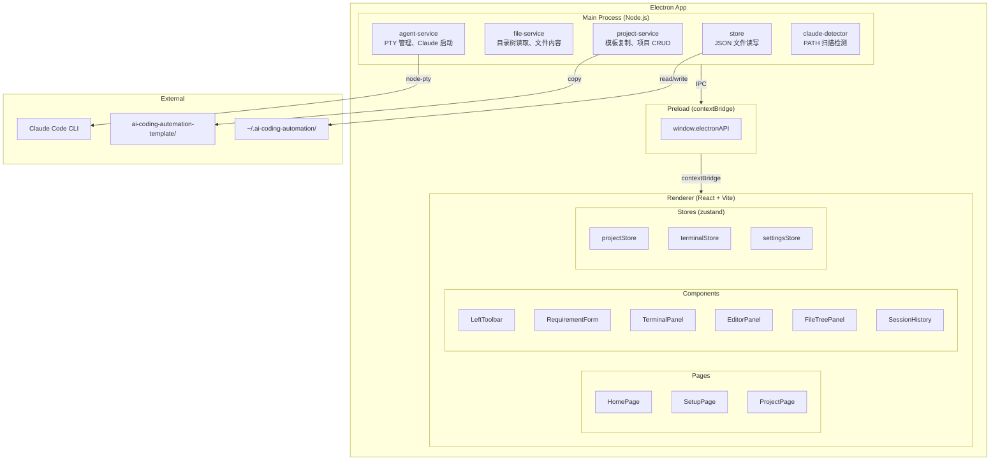

# EasyMint — 架构设计

## 系统架构图



## 数据模型

### projects.json
```json
{
  "projects": [
    {
      "id": "uuid",
      "name": "MyProject",
      "path": "/path/to/project",
      "createdAt": "ISO datetime",
      "lastOpenedAt": "ISO datetime",
      "status": "setup | development | completed",
      "description": ""
    }
  ]
}
```

### settings.json
```json
{
  "theme": "dark | light",
  "defaultProjectDir": "/path/to/default",
  "claudePath": "/usr/local/bin/claude",
  "terminalFontSize": 14
}
```

### sessions.json
```json
{
  "sessions": [
    {
      "id": "uuid",
      "projectId": "uuid",
      "title": "需求访谈 - 2026-05-28",
      "createdAt": "ISO datetime",
      "lastActiveAt": "ISO datetime",
      "claudeSessionId": "claude-session-uuid",
      "status": "active | completed"
    }
  ]
}
```

## 页面/模块树

```
App
├── HomePage (/)
│   └── ProjectCard[]
│       └── NewProjectDialog
├── SetupPage (/setup/:projectId)
│   ├── StepIndicator
│   └── RequirementForm
│       ├── Step1: ProjectOverview
│       ├── Step2: TechPreferences
│       ├── Step3: FeatureList
│       └── Step4: UIStyle
└── ProjectPage (/project/:projectId)
    ├── LeftToolbar
    │   ├── NewProjectButton
    │   ├── FileTreeButton
    │   ├── SessionHistoryButton
    │   ├── TerminalButton
    │   └── SettingsButton
    ├── EditorPanel (placeholder)
    ├── FileTreePanel (conditional)
    ├── SessionHistory (conditional)
    └── TerminalPanel
        └── TerminalTab[]
```

## IPC 通道设计

### project:* 
| 通道 | 方向 | 参数 | 返回 |
|------|------|------|------|
| `project:list` | renderer→main | — | Project[] |
| `project:create` | renderer→main | {name, path} | Project |
| `project:delete` | renderer→main | {id} | void |
| `project:get` | renderer→main | {id} | Project |

### file:*
| 通道 | 方向 | 参数 | 返回 |
|------|------|------|------|
| `file:readTree` | renderer→main | {dirPath} | FileNode[] |
| `file:readContent` | renderer→main | {filePath} | string |
| `file:writeContent` | renderer→main | {filePath, content} | void |

### terminal:*
| 通道 | 方向 | 参数 | 返回 |
|------|------|------|------|
| `terminal:create` | renderer→main | {cwd} | {terminalId} |
| `terminal:write` | renderer→main | {terminalId, data} | void |
| `terminal:resize` | renderer→main | {terminalId, cols, rows} | void |
| `terminal:destroy` | renderer→main | {terminalId} | void |
| `terminal:onData` | main→renderer | {terminalId, data} | — |

### session:*
| 通道 | 方向 | 参数 | 返回 |
|------|------|------|------|
| `session:list` | renderer→main | {projectId} | Session[] |
| `session:resume` | renderer→main | {sessionId} | void |
| `session:delete` | renderer→main | {sessionId} | void |

### claude:*
| 通道 | 方向 | 参数 | 返回 |
|------|------|------|------|
| `claude:detect` | renderer→main | — | {found, path?, version?} |

## 环境变量

无外部服务依赖。Claude CLI 需在 PATH 中可用。

## 打包分发

使用 electron-builder 打包为 macOS `.dmg`。后续可扩展 Windows/Linux。
