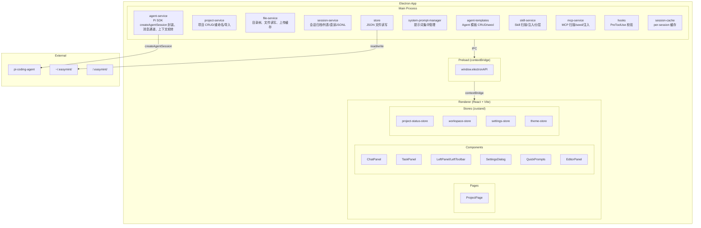

# EasyMint — 架构设计

## 系统架构



## 数据模型

### projects.json (`~/.easymint/`)

```json
{
  "projects": [{
    "id": "uuid",
    "name": "项目名",
    "path": "/path/to/project",
    "createdAt": "ISO",
    "lastOpenedAt": "ISO",
    "status": "setup | development | completed",
    "description": ""
  }]
}
```

### em-settings.json (`~/.easymint/`)

```json
{
  "defaultProjectDir": "~/EasyMintProject",
  "apiProviders": {
    "current": "deepseek-main",
    "configs": {
      "deepseek-main": {
        "presetId": "deepseek", "name": "我的DeepSeek",
        "apiKey": "sk-xxx", "model": "deepseek-v4-pro",
        "models": ["deepseek-v4-pro", "deepseek-v4-flash"],
        "baseUrl": "https://api.deepseek.com/anthropic",
        "context1M": false
      }
    }
  },
  "evaluateMode": false,
  "contextThreshold": 60,
  "showThinking": false,
  "showToolUse": false
}
```

### task.json (`<project>/`)

```json
{
  "tasks": [{
    "id": 1,
    "title": "用户注册功能",
    "description": "...",
    "steps": ["..."],
    "passes": false,
    "evaluated": false,
    "tdd": true,
    "dependsOn": []
  }]
}
```

### escalation.json (`<project>/.easymint/`)

Builder/Evaluator 遇阻塞时写入，Mint 读取并向用户汇报，含建议操作选项。

## IPC 通道

统一前缀规范：`project:` / `file:` / `agent:` / `conv:` / `settings:` / `skill:` / `mcp:` / `upload:` / `system-prompt:` / `session-cache:` / `task:`

关键通道：

| 通道 | 方向 | 说明 |
|------|------|------|
| `agent:sendMessage` | renderer → main | 发送聊天消息 |
| `agent:stream` | main → renderer | SDK 流式事件推送 |
| `agent:setModel` | renderer → main | 切换模型 |
| `agent:context-usage` | main → renderer | 上下文使用率 |
| `agent:spawnAgentChat` | renderer → main | 从模板创建独立 Agent 会话 |
| `conv:messages` | renderer → main | 读取会话历史 |
| `project:update` | renderer → main | 更新项目名称/路径 |
| `project:import` | renderer → main | 导入已有目录为项目 |
| `project:rename-exec` | renderer → main | 重命名项目（复制→重启→清理） |
| `settings:fetchModels` | renderer → main | 从 API 获取模型列表 |
| `git:detect` | renderer → main | 检测 Git 安装状态 |
| `node:detect` | renderer → main | 检测 Node.js 版本 |

## 核心流程

### Chat 会话生命周期

```
sendMessage → createAgentSession → session.prompt(text, options)
    → session.subscribe(AgentSessionEvent) → bridgeSessionEvents → broadcast → ChatPanel.onStream → render
    → result → getContextUsage → 超阈值 → compact → 继续 或 rotateSession → 新 Tab
```

### Mint 按钮流程

```
点击 → onMintClick → 找/建 chat tab → 发 CONTINUE_NEXT_STEP → Mint 读 task.json → 判断下一步
```

### 项目状态刷新

```
agent:exit → onActivity → refreshAll(path) → 读 task.json → 计算任务完成计数 → 更新 UI
```

## Skill 注入

Skills 通过 Pi SDK 的 `resourceLoader` 加载，扫描 `~/.easymint/skills/` 目录，注入 system prompt。

- 内置 Skill 存放在 `resources/skills/`，启动时 seed 到全局目录
- `buildSkillsPrompt` 生成分组注入 system prompt

## MCP 工具清单

easymint-ui（EM 内置，Pi SDK customTools 注入）：

| 工具 | 用途 |
|------|------|
| `show_confirm_dev` | 显示「确认开发」按钮 |
| `refresh_tasks` | 通知前端重新加载 task.json |
| `show_prototype` | 通知前端打开 EM HTML 编辑器 |
| `show_new_project` | 显示「新建项目」按钮 |
| `set_task_status(taskId, status)` | 更新 task.json status + 广播 UI 刷新 |
| `list_issues` | 读取项目 Issue 面板记录的问题清单 |
| `rename_project(newName)` | 重命名当前项目（仅打包版本） |

easymint-vision: `describe_image`（按开关），easymint-web-fetch: `web_fetch`（按开关）

> 注意：Pi SDK 的 `customTools` 不自动添加 `mcp__` 前缀，工具名即为定义时的原始名称。权限白名单和前端按钮检测均使用原始名称。

## 工具校验

`hooks.ts` 中的 `validateTaskStatus` 在 MCP 工具 `execute` 内部做状态一致性校验（不依赖 SDK hook 机制）：

| 规则 | 触发条件 | 拒绝条件 |
|------|---------|---------|
| 未结束不开新 | `set_task_status(?, "building")` | 其他任务 status 为 building 或 evaluating |
| 顺序校验 | `set_task_status(id, "evaluating")` | 目标任务 status ≠ building |
| 失败限定 | `set_task_status(id, "failed")` | 目标任务 status 不是 building/evaluating |

权限系统通过 `canUseTool` 回调（`agent-permission-service.ts`）+ `wrapToolWithPermission` 实现工具级审批，内置 MCP 工具加入 `SAFE_TOOLS` 白名单免审批。

## 会话持久化

```
会话 JSONL: ~/.easymint/sessions/<编码路径>/<sessionId>.jsonl

getSessionMessages 直接读 JSONL → 逐行解析 → 返回全量消息
```

实时流仍走 IPC `agent:stream`，不受影响。

## 提示词架构

`prompts.ts` 集中管理所有提示词：Mint 身份、规则、`<ui_tools>` 工具列表、场景模板、阶段指令、业务构建函数、Agent 模板默认提示词（Builder/Evaluator/Mint-D）。所有文件 import 自此单一来源。

## 设备互联与跨设备迁移（v0.6.6）

> 纯手动模式：无自动扫描/自动重连。方案唯一真相源：`docs/archive/跨设备会话迁移与设备互联方案.md`。

### 主进程服务

| 服务 | 职责 |
|------|------|
| `network-service` | 设备互联核心：mDNS 发现（bonjour-service，手动 3s 扫描窗口/广播 60s）、WS 配对（双向确认）、连接状态机、心跳 30s、统一协议消息分发（`handlePeerMessage` 入站/出站连接共用，双向对等） |
| `device-crypto` | ECDH（P-256）密钥派生 + AES-256-GCM 加解密 + challenge 认证 |
| `migration-service` | 迁移核心：`scanProject`（统一扫描，DEFAULT_EXCLUDE 单一实现）、`prepareAndTransfer`（扫描+打包 zip+握手+分块传输）、`restoreTransfer`（zip 校验→缓存目录→解压→会话恢复→回执） |

### 设备互联协议

```
发现:      mDNS (bonjour) — 广播 60s / 扫描 3s 手动窗口
配对:      requestPair(带公钥) → acceptPair → 各自派生共享密钥 → hello challenge 认证
连接:      WebSocket（已配对设备缓存地址直连）+ 30s 心跳保活
加密:      控制消息明文（unpair-notify/ping）；应用消息（migration transfer-*）AES-256-GCM
解除配对:  unpair 发 unpair-notify 双向解除；hello 校验失败同步解除（防抖动循环）
```

### 迁移数据流

```
发送端:  scanProject(排除构建产物) → zip 打包 → transfer-request → 等 transfer-accept
         → 分块加密传输 → 等回执（restoredCount/sessionRestored 二次确认）
接收端:  accept → zip 落 ~/.easymint/migration-cache/ → sha256 + 文件数校验 → 解压
         → 会话恢复（jsonl 首行 cwd 改写 + JSON.parse 落盘验证）→ 完成卡片 → 删除缓存包
```

关键决策：zip 打包传输 + 完整性握手（manifest fileCount/zipSha256/sessionFile）；压缩包放 EM 缓存目录，**全部恢复完毕才删除**；失败保留包供排查。

## 会话隔离与状态信号（v0.6.5）

status-store 从全局单例改为**按 sessionId 分片**（架构级修复，多会话不串扰）：

```
status-store: statusMap[sessionId] — 信号栈/摘要/压缩/ctxPct 各自独立
委派/shell 广播带 sessionId；StatusBar/AgentBar/ShellBar 按会话过滤
onDelegationCount/onShellCount 加 currentChatRef 过滤
```

时序值用 ref、state 只给 UI 渲染用；流式滚动：输入时间窗判定用户意图，程序性滚动（`programmaticScrollRef` 贴底后立即复位）永不误判。

## 状态指示光效（v0.6.5）

- 3 预设 canvas 渲染（orbit 环绕流光 / slide 顶部滑动 / breathe 呼吸发散）：圆角路径贴合、彗尾半椭圆收尖、多色沿路径流转、呼吸 10 层渐变发散
- 呼吸灯离屏不透明合成（消除圆角/直线交接痕迹，与 dpr 无关）
- 参数固定为组件常量（粗细/速度/拖尾），仅颜色可调；亮色/暗色两套独立配置，settings 持久化
- 关键文件：`settings-store.ts` / `ChatInput.tsx`（输入卡片流光 `input-card-glow`）/ `StatusBar.tsx` / `AppearanceTab.tsx` / index.css CSS 变量
- orbit 环绕流光已 canvas 化（v0.6.5 三预设全 canvas，含彗尾半椭圆收尖）

## 后台 Shell 执行（v0.6.4+）

- `background-shell/tool.ts`：前台 bash 自执行（`executeForeground`）+ 后台 shell（Git Bash、进程树 taskkill /T、不 detached）
- `encoding.ts`：UTF-8/GBK 自动判定解码（全量 UTF-8→去尾前缀→GBK）——Windows 乱码根因修复
- Windows 适配：execSync 改 spawnSync 不走 cmd shell；dev 脚本绕过 .cmd 包装（`scripts/dev-electron.cjs` esbuild + electron cli 直启）；GPU/HTTP 磁盘缓存禁用走内存；虚拟网卡地址同网段优先（`pickBestAddress`）
